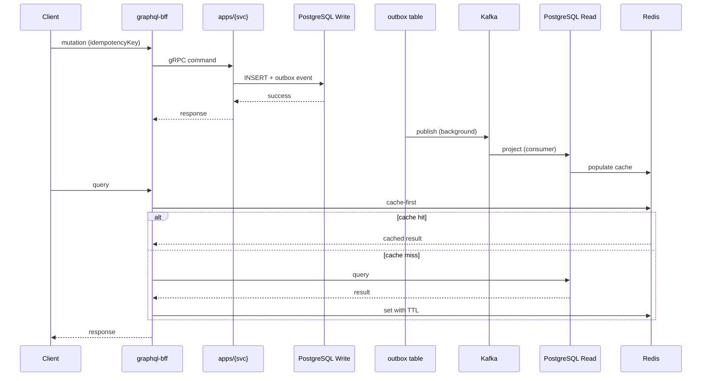

# Aureum Architecture Reference

## CQRS + Outbox Flow



## Key Contracts

| Layer | Protocol | Port |
|-------|----------|------|
| Public API | GraphQL (gqlgen) | 8080 |
| Internal | gRPC | 9000+ |
| Database | PostgreSQL 16 | 5432 |
| Cache | Redis 7 | 6379 |
| Events | Kafka | 9092 |
| Auth | Keycloak | 8443 |

## Error Domain

```
domain.ErrNotFound        → gRPC: NotFound / GraphQL: NOT_FOUND
domain.ErrConflict         → gRPC: AlreadyExists / GraphQL: CONFLICT
domain.ErrValidation       → gRPC: InvalidArgument / GraphQL: BAD_REQUEST
domain.ErrUnauthorized     → gRPC: Unauthenticated / GraphQL: UNAUTHENTICATED
domain.ErrForbidden        → gRPC: PermissionDenied / GraphQL: FORBIDDEN
domain.ErrIdempotencyKey   → gRPC: InvalidArgument / GraphQL: BAD_REQUEST
```
