# Development Workflow

## Flow

```mermaid
graph LR
    A[Pre-Flight] --> B[Impact Analysis]
    B --> C[Feature Planning]
    C --> D[ADR / Docs]
    D --> E[TDD: RED]
    E --> F[TDD: GREEN]
    F --> G[TDD: REFACTOR]
    G --> H[Cross-Cutting]
    H --> I[Git Commit]
    I --> J[Push & PR]
    J --> K[CI Pass]
    K --> L[Merge]
```

## Pre-Flight Checklist
- [ ] `git status` — clean working tree
- [ ] `git pull --rebase` — up to date with base branch
- [ ] `make lint` — no errors
- [ ] `make test` — all green

## Commit Ready Checklist
- [ ] `make lint` passes
- [ ] `make test` passes
- [ ] `make build` succeeds
- [ ] Tests for new code exist (RED before GREEN)
- [ ] ADR updated if architecture change
- [ ] Runbook created for new feature
- [ ] Security doc reviewed
- [ ] Conventional commit message

## Branch Convention
- `feature/PROJ-123-short-desc`
- `bugfix/PROJ-123-short-desc`
- `hotfix/PROJ-123-short-desc`
- `release/v1.2.3`
